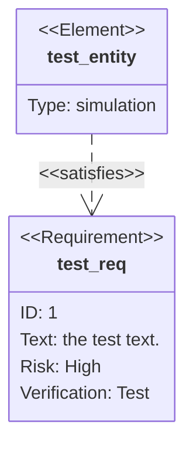

# 第八天笔记

## 自定义控件的实现

#### View 绘制过程

##### Activity 和 View 的关系

1. **Window 类**：负责在 `Activity` 中展示内容（具体实现为 `PhoneWindow` 类）
2. **DecorView**：`Window` 创建出根布局 `DecorView`（继承自 `FrameLayout`）

##### 单个 View 的绘制步骤

系统根据布局树完成界面绘制，单个 View 需要经过三个步骤：

1. **计算 View 的宽高**：`measure`
2. **计算 View 的位置**：`layout`
3. **绘制 View 的内容**：`draw`

#### 布局树逐级向下调用

布局树的绘制过程从上到下逐级调用，具体步骤如下：

- **测量**：
  - `performMeasure()`
  - `measure()`
  - `onMeasure()`
- **布局**：
  - `performLayout()`
  - `layout()`
  - `onLayout()`
- **绘制**：
  - `performDraw()`
  - `draw()`
  - `onDraw()`

#### 视图树调用流程图


#### 位置的描述依赖坐标系

- Android 的坐标系定义为：
  - 屏幕的左上角为坐标原点
  - 向右为 x 轴增大方向
  - 向下为 y 轴增大方向

#### 自定义 View

##### draw 函数

1. **作用**：绘制内容在给定的 Canvas 上

2. **调用时机**：要保证 layout 之后再调用这个方法

3. **注意事项**：自定义 View 时考虑优先重写 onDraw 方法而不是这个方法

4. **继承关系**：如果一定要重写 draw 方法，要记得调用父类方法

5. 实现步骤：有 7 个绘制步骤：

   - 绘制背景
- 其余步骤依次类推

#### 位置的描述依赖坐标系

- Android 的坐标系定义为：
  - 屏幕的左上角为坐标原点
  - 向右为 x 轴增大方向
  - 向下为 y 轴增大方向


##### draw 函数

1. **作用**：绘制内容在给定的 Canvas 上。

2. **调用时机**：要保证 layout 之后再调用这个方法。

3. **注意事项**：自定义 View 时考虑优先重写 `onDraw` 方法而不是这个方法。

4. **继承关系**：如果一定要重写 `draw` 方法，要记得调用父类方法。

5. **实现步骤**：有 7 个绘制步骤：
   1. 绘制背景
   2. 如有必要，保存画布图层以准备淡入淡出动画
   3. **绘制内容**
   4. 绘制子 View（即调用 `childView.draw`）
   5. 如有必要，绘制淡入淡出并恢复图层
   6. 绘制装饰（例如滚动条）
   7. 如有必要，绘制默认焦点高亮

```java
/**
 * Manually render this view (and all of its children) to the given Canvas.
 * The view must have already done a full layout before this function is
 * called. When implementing a view, implement
 * {@link #onDraw(android.graphics.Canvas)} instead of overriding this method.
 * If you do need to override this method, call the superclass version.
 *
 * @param canvas The Canvas to which the View is rendered.
 */
@CallSuper
public void draw(Canvas canvas) {
    final int privateFlags = mPrivateFlags;
    mPrivateFlags = (privateFlags & ~PFLAG_DIRTY_MASK) | PFLAG_DRAWN;

    /*
     * Draw traversal performs several drawing steps which must be executed
     * in the appropriate order:
     *
     *      1. Draw the background
     *      2. If necessary, save the canvas' layers to prepare for fading
     *      3. Draw view's content
     *      4. Draw children
     *      5. If necessary, draw the fading edges and restore layers
     *      6. Draw decorations (scrollbars for instance)
     *      7. If necessary, draw the default focus highlight
     */
}
```

##### onDraw 函数

1. **调用时机**：在 7 个绘制步骤中的第三步。
2. **实现**：绘制内容。

```java
protected void onDraw(Canvas canvas) {
    // Step 1, draw the background, if needed
    int saveCount;
    drawBackground(canvas);

    // skip step 2 & 5 if possible (common case)
    final int viewFlags = mViewFlags;
    boolean horizontalEdges = (viewFlags & FADING_EDGE_HORIZONTAL) != 0;
    boolean verticalEdges = (viewFlags & FADING_EDGE_VERTICAL) != 0;

    if (!verticalEdges && !horizontalEdges) {
        // Step 3, draw the content
        onDraw(canvas);
    }
}
```

#### 绘制内容在给定的 Canvas 上

Canvas 类：Android 中用于绘制图形的重要类。它包含了许多绘图方法，主要可以分为以下几类：

| 绘制基本的几何形状，如矩形、圆形、椭圆等                  | 使用路径（`Path`）定义复杂的图形 |
| :-------------------------------------------------------- | :------------------------------- |
| drawRect(RectF rect, Paint paint)                         | drawPath(Path path, Paint paint) |
| drawCircle(float cx, float cy, float radius, Paint paint) |                                  |
| drawOval(RectF oval, Paint paint)                         |                                  |

| 用于在画布上绘制文本                                 | 绘制位图图像                                                 |
| :--------------------------------------------------- | :----------------------------------------------------------- |
| drawText(String text, float x, float y, Paint paint) | drawBitmap(Bitmap bitmap, float left, float top, Paint paint) |

#### 设置绘制的颜色和样式

- **drawColor(int color)**: 设置绘制的颜色
- **drawPaint(Paint paint)**: 设置绘制的样式

#### 对画布进行变换

- **translate(float dx, float dy)**: 平移变换
- **rotate(float degrees)**: 旋转变换

#### 在画布上创建和操作图层，实现图层效果

- **save()**: 保存当前画布的状态
- **restore()**: 恢复之前保存的画布状态

#### Paint 类配合提供绘制参数

```java
Paint paint = new Paint();
paint.setColor(Color.RED); // 设置颜色
paint.setTextSize(24); // 设置文字大小
paint.setTypeface(Typeface.create(Typeface.DEFAULT, Typeface.BOLD)); // 设置字体样式
paint.setStrokeWidth(2); // 设置绘制线条宽度
paint.setAntiAlias(true); // 启用抗锯齿
```

#### Path 类配合描述复杂图形

```java
Path path = new Path();
path.moveTo(x: 100, y: 200); // 从当前位置移动到指定位置（不画线）
path.lineTo(x: 100, y: 200); // 从前点绘制一条线到指定点
RectF oval = new RectF(left: 100, top: 100, right: 300, bottom: 600); // 绘制圆线
path.arcTo(oval, startAngle: 100, sweepAngle: 180, forceMoveTo: true); // 绘制弧线
path.close(); // 连接当前点和起始点
```

#### 自定义 ViewGroup

##### measure 函数

1. **作用**: 计算 View 的宽高
2. **调用 onMeasure 完成真正的计算工作，且子类应该重写 onMeasure**
3. **final 修饰该方法，不可重写**

```java
public final void measure(int widthMeasureSpec, int heightMeasureSpec) {
    boolean optical = isLayoutModeOptical() != this;
    if (optical != isLayoutModeOptical(mParent)) {
        // ... 相关代码
    }
}
```

onMeasure 函数

1. **作用**: 计算 View 的宽高，应由子类重写，以提供对其内容的准确有效的测量。
2. **约定**: 重写此方法时，必须调用 `setMeasuredDimension(width, height)` 来存储测量好的宽度和高度。
3. **没有 final 修饰符，可重写**

```java
protected void onMeasure(int widthMeasureSpec, int heightMeasureSpec) {
    setMeasuredDimension(getDefaultSize(getSuggestedMinimumWidth(), widthMeasureSpec),
                         getDefaultSize(getSuggestedMinimumHeight(), heightMeasureSpec));
}
```

#### MeasureSpec 类

MeasureSpec 包含两部分信息：

- **低 30 位为 SpecSize**，即尺寸
- **高 2 位为 SpecMode**，即测量模式

```java
@Override
protected void onMeasure(int widthMeasureSpec, int heightMeasureSpec) {
    int widthSpecMode = MeasureSpec.getMode(widthMeasureSpec);
    int widthSpecSize = MeasureSpec.getSize(widthMeasureSpec);
    int heightSpecMode = MeasureSpec.getMode(heightMeasureSpec);
    int heightSpecSize = MeasureSpec.getSize(heightMeasureSpec);

    int newWidthSpec = MeasureSpec.makeMeasureSpec(1, MeasureSpec.AT_MOST);
}
```

#### MeasureSpec 高 2 位为 SpecMode，即测量模式

| 测量模式        | 说明                                                         |
| :-------------- | :----------------------------------------------------------- |
| **UNSPECIFIED** | 父 View 对子 View 的大小不做限制                             |
| **EXACTLY**     | 父 View 计算好了子 View 具体的宽高，子 View 的最终大小就是 SpecSize 指定的值 |
| **AT_MOST**     | 父 View 指定了一个可用大小 SpecSize，子 View 的大小不能大于这个值 |

onMeasure 函数

1. **作用**: 计算 View 的宽高，应由子类重写，以提供对其内容的准确有效的测量。
2. **约定**: 重写此方法时，必须调用 `setMeasuredDimension(width, height)` 来存储测量好的宽度和高度。
3. **没有 final 修饰符，可重写**

```java
protected void onMeasure(int widthMeasureSpec, int heightMeasureSpec) {
    setMeasuredDimension(getDefaultSize(getSuggestedMinimumWidth(), widthMeasureSpec),
                         getDefaultSize(getSuggestedMinimumHeight(), heightMeasureSpec));
}
```

### MeasureSpec 类

MeasureSpec 包含两部分信息：

- **低 30 位为 SpecSize**，即尺寸
- **高 2 位为 SpecMode**，即测量模式

```java
@Override
protected void onMeasure(int widthMeasureSpec, int heightMeasureSpec) {
    int widthSpecMode = MeasureSpec.getMode(widthMeasureSpec);
    int widthSpecSize = MeasureSpec.getSize(widthMeasureSpec);
    int heightSpecMode = MeasureSpec.getMode(heightMeasureSpec);
    int heightSpecSize = MeasureSpec.getSize(heightMeasureSpec);

    int newWidthSpec = MeasureSpec.makeMeasureSpec(1, MeasureSpec.AT_MOST);
}
```

#### MeasureSpec 高 2 位为 SpecMode，即测量模式

| 测量模式        | 说明                                                         |
| :-------------- | :----------------------------------------------------------- |
| **UNSPECIFIED** | 父 View 对子 View 的大小不做限制                             |
| **EXACTLY**     | 父 View 计算好了子 View 具体的宽高，子 View 的最终大小就是 SpecSize 指定的值 |
| **AT_MOST**     | 父 View 指定了一个可用大小 SpecSize，子 View 的大小不能大于这个值 |

### ViewGroup 中 MeasureSpec 计算公式

子 View 的布局参数（通过 `childView.getLayoutParams()` 获取） + 父 View 的测量要求 = 子 View 的 MeasureSpec

| 测量模式        | 精确值                                         | MATCH_PARENT                                   | WRAP_CONTENT                                   |
| :-------------- | :--------------------------------------------- | :--------------------------------------------- | :--------------------------------------------- |
| **EXACTLY**     | SpecSize: View Group Size<br>SpecMode: EXACTLY | SpecSize: View Group Size<br>SpecMode: EXACTLY | SpecSize: View Group Size<br>SpecMode: AT_MOST |
| **AT_MOST**     | SpecSize: View Group Size<br>SpecMode: AT_MOST | SpecSize: View Group Size<br>SpecMode: AT_MOST | SpecSize: View Group Size<br>SpecMode: AT_MOST |
| **UNSPECIFIED** | SpecSize: 0<br>SpecMode: UNSPECIFIED           | SpecSize: 0<br>SpecMode: UNSPECIFIED           | SpecSize: 0<br>SpecMode: UNSPECIFIED           |

### onMeasure 函数实现

1. 父 View 测量要求（MeasureSpec）作为 `onMeasure` 的入参传入：UNSPECIFIED, EXACTLY, AT_MOST
2. 实现：
   - 根据公式：子 View 布局参数（+ 父 View 测量要求）= 子 View 测量要求
   - 将子 View 测量要求作为参数，调用子 View 的 `measure` 方法
   - 根据当前 ViewGroup 布局策略计算自己的宽高
3. 调用 `setMeasuredDimension(int, int)` 保存计算好的宽高


### layout 函数

1. 布局机制的第二阶段（第一阶段是测量）
2. **作用**: 给所有子 View 分配位置
3. **实现**: 在这个阶段，每个父 View 调用其所有子 View 的 `layout` 方法来确定它们的位置。
4. 派生类不应覆盖此方法，子 View 的派生类应覆盖 `onLayout` 方法。

```java
public void layout(int l, int t, int r, int b) {
    if ((mPrivateFlags & PFLAG3_MEASURE_NEEDED_BEFORE_LAYOUT) != 0) {
        onMeasure(mOldWidthMeasureSpec, mOldHeightMeasureSpec);
        mPrivateFlags3 &= ~PFLAG3_MEASURE_NEEDED_BEFORE_LAYOUT;
    }
    ...
}
```

### onLayout 函数

1. 被 `layout` 方法调用
2. **作用**: 为该 View 的子 View 分配位置
3. 有子 View 的派生类应重写该方法，并对每个子 View 调用 `layout` 方法，通常是使用在测量过程中存储的子 View 尺寸来完成的。

#### . `onLayout` 方法

- **定义**：在 `layout` 被调用时，分配每个子 `View` 的位置和尺寸。
- 参数：
  - `changed`：此视图的尺寸或位置是否发生变化。
  - `left`：相对于父视图的左边位置。
  - `top`：相对于父视图的顶部位置。
  - `right`：相对于父视图的右边位置。
  - `bottom`：相对于父视图的底部位置。

#### 2. 使用在测量过程中存储的子 `View` 尺寸来完成布局

- 在 `onLayout` 方法中调用子视图的 `layout` 方法，使用 `getMeasuredWidth` 和 `getMeasuredHeight` 获取子视图的宽度和高度。

#### 3. `getMeasuredHeight` 和 `getHeight` 的区别

- `getMeasuredWidth` / `getMeasuredHeight`：
  - **作用**：获取 `View` 测量的宽高。
  - **赋值时机**：`measure` 过程中。
  - **赋值方法**：`setMeasuredDimension`。
  - **值大小**：一般情况下二者获取的宽高值相等。
- `getWidth` / `getHeight`：gtcg
  - **作用**：获取 `View` 最终的宽高。
  - **赋值时机**：`layout` 过程中。
  - **赋值方法**：`layout` 中传递的 4 个参数之间的运算。

#### 4. 如何定义标签间距？

- 自定义属性：

  - 在 `res/values/` 新建 `attrs.xml` 文件，定义标签间距的属性。

  - 示例代码：

    ```xml
    <?xml version="1.0" encoding="utf-8"?>
    <resources>
        <declare-styleable name="TagCloud">
            <attr name="hMargin" format="dimension"/>
            <attr name="vMargin" format="dimension"/>
        </declare-styleable>
    </resources>
    ```

#### 1. 自定义属性与标签间距

**定义自定义属性 `gravity`：**

```xml
<attr name="gravity">
    <flag name="top" value="0x30" />
    <flag name="bottom" value="0x50" />
    <flag name="left" value="0x03" />
    <flag name="right" value="0x05" />
    <flag name="center_vertical" value="0x10" />
</attr>
```

**定义混合类型属性 `background`：**

```xml
<attr name="background" format="reference|color" />
```

#### 2. 在 XML 中使用属性

**示例代码：**

```xml
<?xml version="1.0" encoding="utf-8"?>
<LinearLayout xmlns:android="http://schemas.android.com/apk/res/android"
    android:id="@+id/parent"
    android:layout_width="match_parent"
    android:layout_height="match_parent">

    <com.xiaomi.customview.TagCloud
        xmlns:app="http://schemas.android.com/apk/res-auto"
        android:id="@+id/cloud"
        android:layout_width="match_parent"
        android:layout_height="match_parent"
        app:hMargin="40dp"
        app:vMargin="20dp" />
</LinearLayout>
```

**在 Java 代码中获取属性：**

```java
public TagCloud(@NonNull Context context, @Nullable AttributeSet attrs) {
    super(context, attrs);
    TypedArray a = context.obtainStyledAttributes(attrs, R.styleable.TagCloud);
    horizontalMargin = a.getDimension(R.styleable.TagCloud_hMargin, 20);
    verticalMargin = a.getDimension(R.styleable.TagCloud_vMargin, 10);
    a.recycle();
}
```


#### 3. 响应手势操作

**MotionEvent 类（运动事件）包含：ACTION（事件类型）+ 事件位置**


`onInterceptTouchEvent`:

**用途:**当先分发给子View处理,且子View的dispatchTouchEvent返回true(子View表示会消费这个事件),当前ViewGroup依然有捕获的能力

**场景**:支持滑动的ViewGroup中的子View做了事件消费,第一个事件action_down发生在该子View范围内,该子View的dispatchTouchEvent方法返回true

第二个事件是action_move,此时当前ViewGroup判断为滑动手势,由自己开始消费(onInterceptTouchEvent返回true控制这事件),并且给子View分发action_cancel事件(帮助子View结束此组手势)

**事件类型：**

- `ACTION_DOWN`：按下
- `ACTION_POINTER_DOWN`：第 n 个手指按下
- `ACTION_MOVE`：移动
- `ACTION_UP`：抬起
- `ACTION_POINTER_UP`：多指按下的前提下，抬起一个手指
- `ACTION_CANCEL`：取消

**事件位置：**

- `(x, y)` 坐标

**示例代码：**

```java
@Override
public boolean onTouchEvent(MotionEvent event) {
    switch (event.getAction()) {
        case MotionEvent.ACTION_DOWN:
            // 处理按下事件
            break;
        case MotionEvent.ACTION_MOVE:
            // 处理移动事件
            break;
        case MotionEvent.ACTION_UP:
            // 处理抬起事件
            break;
        case MotionEvent.ACTION_CANCEL:
            // 处理取消事件
            break;
    }
    return true;
}
```

**用户的真实有意义的手势是由多个 MotionEvent（运动事件）组合而成**

**例如：**

- 用户滑动手势：
  - DOWN事件
  - MOVE事件（若干个）
  - UP事件
  - 进入另一个视图时的CANCEL事件

**示例流程图：**



## GestureDetector 类及其回调方法

1. **onDown(MotionEvent e)**:
   - 用户按下屏幕时调用，表示屏幕已经被触摸。
   - 返回 `false`。
2. **onShowPress(MotionEvent e)**:
   - 用户按下屏幕一段时间后，但未完成其他手势时调用。
   - 无返回值。
3. **onSingleTapUp(MotionEvent e)**:
   - 用户轻触屏幕时调用，且未发生滑动或长按。
   - 返回 `false`。
4. **onScroll(MotionEvent e1, MotionEvent e2, float distanceX, float distanceY)**:
   - 用户在屏幕上滑动时调用，提供起始事件和当前事件之间的滑动距离。
   - 返回 `false`。
5. **onLongPress(MotionEvent e)**:
   - 用户长按屏幕时调用，用于处理长按事件。
   - 无返回值。
6. **onFling(MotionEvent e1, MotionEvent e2, float velocityX, float velocityY)**:
   - 用户快速滑动后松开时调用，提供起始事件、当前事件以及滑动速度。
   - 返回 `false`。

#### MotionEvent 事件类型

- **ACTION_UP**: 抬起
- **ACTION_POINTER_UP**: 多指按下的前提下，抬起一个手指
- **ACTION_CANCEL**: 取消

#### 事件位置

- 事件位置为 `(x, y)` 坐标系。

#### 手势的组合

用户的真实手势是由多个 MotionEvent（运动事件）组合而成。例如：

- DOWN事件 -> MOVE事件 -> UP事件 -> CANCEL事件

#### 常见手势的事件组合

- **点击**: `down + up`
- **长按**: `down`（持续一段时间没有 `move` 和 `up` 事件）
- **滑动**: `down + move + up`
- **双击**: `down + up + down + up`
- **双指放大/缩小**: `down + pointer_down + move + pointer_up + up`
- **长按拖动**: `down + move + up`（满足触发长按的阈值）
- **边缘滑动**: `down + move + up`（区别在于事件位置在边缘）

#### GestureDetector 类

- **作用**: 提供封装好的手势判断结果。

#### 使用 onTouchEvent 方法或 onTouchListener 处理手势

通过重写 `onTouchEvent` 方法或注册 `onTouchListener`，可以将 `MotionEvent` 交给 `GestureDetector` 进行处理。

- **重写 onTouchEvent 方法**:

```java
@Override
public boolean onTouchEvent(MotionEvent event) {
    return mDetector.onTouchEvent(event);
}
```

- **注册 onTouchListener**:

```java
findViewById(R.id.parent).setOnTouchListener(new View.OnTouchListener() {
    @Override
    public boolean onTouch(View v, MotionEvent event) {
        return mDetector.onTouchEvent(event);
    }
});
```

#### 手势分发及响应过程：View 处理流程

- **流程图**:

```markdown
开始
 └── View.dispatchTouchEvent()（分发事件）
      ├── 是否注册了Touch事件监听
      │    ├── true：View.onTouch()
      │    │    ├── true：事件消费，不再向下分发
      │    │    └── false：事件无法消费，继续向下分发
      │    └── false：onTouchEvent()
      │         ├── 是否注册了点击事件
      │         │    ├── true：performClick() -> onClick()
      │         │    └── false：事件结束
      └── 结果
```

- **事件处理**:
  - 如果我们认为一个有意义的手势是由 `ACTION_DOWN` 开始的一组 `MotionEvent` 事件组成，所以如果需要响应手势，第一个 `ACTION_DOWN` 就应该开始消费，即 `onTouch` 返回 `true`（且整个手势都应该持续返回 `true`）。如果返回 `false`，那么后续父 View 将不会把该组事件分发到当前 View。

#### 手势分发及响应过程：ViewGroup 处理流程

- **流程图**:

```markdown
开始
 └── ViewGroup.dispatchTouchEvent()（接收传递的事件）
      ├── ViewGroup.onInterceptTouchEvent()（拦截事件）
      │    ├── true：不允许事件继续向子View传递
      │    │    └── ViewGroup交给dispatchTouchEvent()（即View.dispatchTouchEvent()）
      │    │         ├── 自己处理该事件 -> onTouchEvent() -> performClick() -> onClick()
      │    └── false：允许事件继续向子View传递
      │         ├── 找到被点击的子View（遍历所有子View）
      │         │    ├── 找到被点击的子View
      │         │    │    └── 调用子View的dispatchTouchEvent()（实现了事件传递：ViewGroup -> View）
      │         │    └── 找不到被点击的子View（如点击了空白处）
      └── 结果
```

- **事件处理**:
  - `ViewGroup` 通过 `dispatchTouchEvent()` 分发事件，事件分发到子 View 时，会调用 `onInterceptTouchEvent()` 判断是否拦截事件。
  - 如果拦截事件，`ViewGroup` 自己处理事件；如果不拦截，继续向子 View 传递，找到被点击的子 View 并调用其 `dispatchTouchEvent()` 进行事件传递和处理。

#### onInterceptTouchEvent

- **作用**: 即使事件是无分发给子 View 处理，且子 View 的 `dispatchTouchEvent` 返回 `true`（子 View 表示会消费这个事件），当前 `ViewGroup` 依然有拦截的能力。
- **场景**: 支持该功能的 `ViewGroup` 中的子 `View` 做了事件消费，第一个事件 `action_down` 发生在该子 `View` 范围内，该子 `View` 的 `dispatchTouchEvent` 方法返回 `true`。第二个事件是 `action_move`，此时当前 `ViewGroup` 判断为滑动手势，由自己开始消费（`onInterceptTouchEvent` 返回 `true` 拦截该事件），并且给子 `View` 分发 `action_cancel` 事件（帮助子 `View` 结束此组手势响应）。

#### 扩展内容

- **GestureDetector#OnDoubleTapListener**

  - **作用**: 检测双击手势。
  - **使用**: 使用方式同 `GestureDetector`。

- **ScaleGestureDetector 类**

  - **作用**: 检测双指缩放手势。
  - **使用**: 使用方式同 `GestureDetector`。

- **ViewDragHelper / DragShadowBuilder 类**

  - **相同的作用**: 都是帮助实现拖拽逻辑的辅助类。

  - **不同的能力和场景**:

    |              | ViewDragHelper                          | DragShadowBuilder                          |
    | :----------- | :-------------------------------------- | :----------------------------------------- |
    | **场景**     | 针对 `ViewGroup` 中拖拽子 `View` 的场景 | 适用于更多场景，甚至支持跨进程拖动传递数据 |
    | **使用难易** | 简单                                    | 复杂                                       |


#### 课后阅读

- [Android 开发者指南: 自定义视图组件](https://developer.android.com/develop/ui/views/layout/custom-views/custom-components?hl=zh-cn)


j