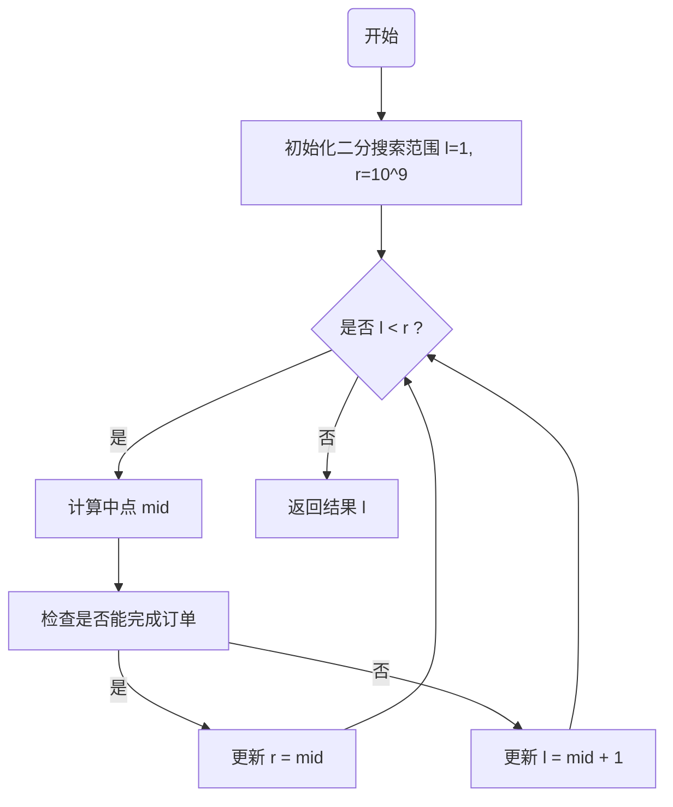

# 题目解析——小F的糖果工厂 | 豆包MarsCode AI刷题

### 问题解析

#### 问题描述

在这个问题中，工厂需要完成一个糖果订单，具体要求如下：

1. **单一种类装箱**：每包糖果只能由一种类型的糖果组成；
2. **最低数量要求**：每包糖果的数量不得少于 `b`；
3. **总包数要求**：需要生产至少 `a` 包糖果。

为了满足这些条件，我们需要计算完成订单所需的 **最少天数**，同时保证糖果的生产方式高效合理。

#### 输入说明

- `n`：糖果种类数；
- `a`：需要的糖果包数；
- `b`：每包糖果的最少数量；
- `candies`：一个长度为 `n` 的列表，表示每种糖果每天的生产数量。

#### 输出说明

返回完成订单的最少天数（一个整数）。

#### 核心思路

为了解决这个问题，我们需要找到满足要求的最小天数，并尽量减少计算复杂度。因此，采用以下策略：

1. 二分搜索：
   - 二分搜索是一种高效的算法，用于在范围内查找目标值。在本问题中，我们通过二分搜索来缩小天数的范围，逐步接近最优解。
2. 检验函数：
   - 对于每一个候选天数，检查能否在这段时间内完成订单。这个检验函数的实现至关重要。

#### 方法论

- 将问题转化为判断性问题：对于给定的天数 `days`，判断是否能够完成订单。
- 在 `[1, 10^9]` 的范围内，通过二分法快速定位最小满足条件的天数。

------

### 图解（Mermaid）

以下是二分搜索流程的可视化示意图：



------

### 代码详解

#### 完整代码

```python
def solution(n: int, a: int, b: int, candies: list) -> int:
    """
    计算完成糖果订单所需的最少天数
    参数:
        n: int - 糖果种类数
        a: int - 需要的糖果包数
        b: int - 每包糖果的最少数量
        candies: list - 每种糖果每天的生产数量
    返回:
        int - 完成订单的最少天数
    """
    def can_finish(days: int) -> bool:
        """
        检查在给定天数内是否能完成订单
        参数:
            days: int - 给定的天数
        返回:
            bool - 是否能完成订单
        """
        total_packages = 0  # 可生产的糖果包总数
        for c in candies:
            # 计算每种糖果在 days 天内能生产的包数
            total_packages += (c * days) // b
            # 剪枝：如果包数达到或超过目标，直接返回 True
            if total_packages >= a:
                return True
        return total_packages >= a

    # 二分查找范围初始化
    l, r = 1, 10**9  # 生产天数的最小值和最大值
    while l < r:
        mid = (l + r) // 2  # 中间值
        if can_finish(mid):  # 检查当前天数是否足够
            r = mid  # 缩小上界
        else:
            l = mid + 1  # 增加下界
    return l

# 测试样例
if __name__ == '__main__':
    print(solution(3, 10, 20, [7, 9, 6]))  # 输出：10
    print(solution(4, 5, 15, [3, 10, 8, 4]))  # 输出：4
    print(solution(2, 100, 5, [1, 10]))  # 输出：46
```

------

#### 代码细节说明

1. **核心函数 `can_finish(days)`**：
   - **功能**：判断在指定的天数内，是否能够完成订单。
   - 逻辑：
     - 遍历 `candies` 列表，逐一计算每种糖果在 `days` 天内的生产能力： 包数=⌊生产总量每包糖果的最少数量⌋\text{包数} = \left\lfloor \frac{\text{生产总量}}{\text{每包糖果的最少数量}} \right\rfloor
     - 累加所有种类的糖果包数，并判断是否大于等于目标值 `a`。
     - 提前剪枝：一旦达到 `a`，即可返回 True，减少不必要的计算。
2. **二分搜索部分**：
   - 初始化范围为 `[1, 10^9]`，其中 `10^9` 是上限值；
   - 每次通过计算中点 `mid = (l + r) // 2` 来缩小搜索范围；
   - 如果 `can_finish(mid)` 为 True，则说明可以在 `mid` 天内完成，更新右边界 `r = mid`；
   - 如果为 False，则说明需要更多天数，更新左边界 `l = mid + 1`。
3. **返回结果**：
   - 当二分范围缩小到 `l == r` 时，返回 `l`，即满足条件的最少天数。

------

### 时间与空间复杂度分析

#### 时间复杂度

1. 二分搜索复杂度：$O(log⁡(109))=O(30)$
2. 每次二分检查调用 `can_finish`，需要遍历糖果种类，总复杂度为 $O(n)$。
3. 综合复杂度：$O(n⋅log⁡(109))=O(n⋅30)$，非常高效。

#### 空间复杂度

- 空间复杂度为$O(1)$，因为只使用了常量额外空间。

------

### 总结

#### 题目类型与难度

本题属于 **二分答案（Binary Search on Answer）** 类问题，是算法竞赛和面试中的经典题型。难度定位在 **中等偏上** —— 题目本身理解门槛不高，但要求能够识别出"最小化天数"背后的单调性特征，并将优化问题转化为判定问题。

#### 核心算法技巧

- **二分搜索**：在 $[1, 10^9]$ 的天数范围内二分查找最小可行天数，每次将搜索空间减半，复杂度仅为 $O(\log C)$。
- **贪心判定函数**：`can_finish(days)` 对每种糖果独立计算可包装数 $\lfloor (c \times days) / b \rfloor$，累加后与目标 $a$ 比较。
- **剪枝优化**：判定过程中一旦累计包数达到 $a$ 立即返回，减少不必要的遍历。

#### 时间复杂度

- 二分搜索执行 $O(\log 10^9) \approx 30$ 轮。
- 每轮调用 `can_finish` 遍历 $n$ 种糖果，耗时 $O(n)$。
- **总体**：$O(n \log C) = O(30n)$，在 $n$ 较大时依然高效。

#### 空间复杂度

仅使用了常数个辅助变量，**空间复杂度为 $O(1)$**。

#### 其他解法对比

| 解法 | 复杂度 | 说明 |
|------|--------|------|
| **二分答案**（本题解法） | $O(n \log C)$ | 利用单调性高效逼近最优值 |
| **直接模拟** | $O(C \cdot n)$ | 从第 1 天逐日模拟，$C$ 很大时不可行 |
| **数学推导** | $O(n)$ | 对每种糖果独立求天数再取 max，但忽略"总包数"的跨种类合并逻辑，仅适用于简化版本 |

直接模拟在大数据量下会超时；纯数学推导无法处理多种糖果联合满足总包数的场景。二分答案在二者之间找到了最佳平衡。

#### 本题启示

1. **识别单调性是关键**：天数越多，能生产的包数越多（或至少不减少），这种单调性使得二分答案可行。
2. **判定函数比求解函数简单**：检查"给定天数是否可行"通常比直接"求最少天数"容易得多。
3. **拆解问题**：每种糖果独立生产、互不干扰，因此可以分别计算再汇总——这是典型的"独立子问题 + 汇总判定"模式，可推广到资源分配、任务调度等场景。
4. **边界谨慎**：二分右边界取 $10^9$ 需保证足够大（当 $a$ 极大且单日产量极小时确实可能需要接近该上限），左边界从 1 开始确保至少生产一天。