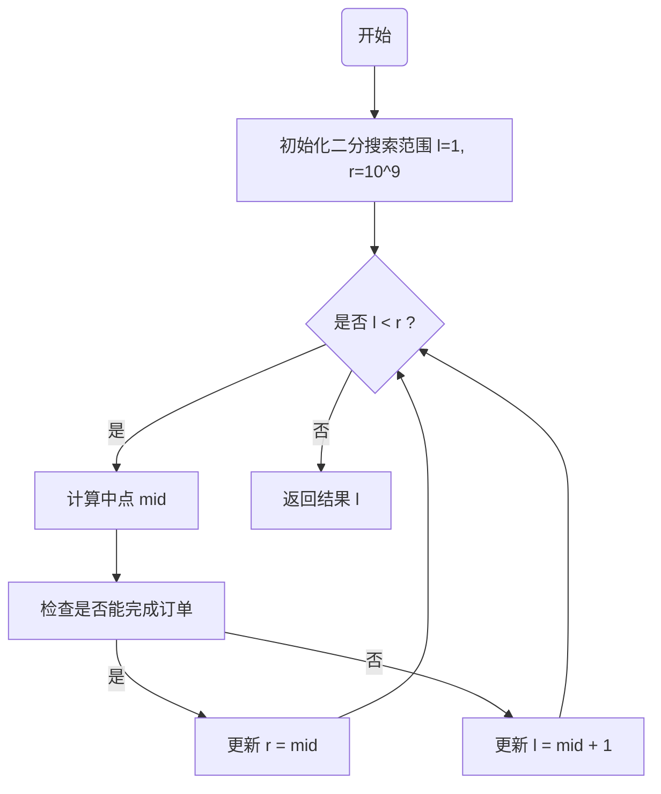

# 题目解析——小F的糖果工厂 | 豆包MarsCode AI刷题

### 问题解析

#### 问题描述

在这个问题中，工厂需要完成一个糖果订单，具体要求如下：

1. **单一种类装箱**：每包糖果只能由一种类型的糖果组成；
2. **最低数量要求**：每包糖果的数量不得少于 `b`；
3. **总包数要求**：需要生产至少 `a` 包糖果。

为了满足这些条件，我们需要计算完成订单所需的 **最少天数**，同时保证糖果的生产方式高效合理。

#### 输入说明

- `n`：糖果种类数；
- `a`：需要的糖果包数；
- `b`：每包糖果的最少数量；
- `candies`：一个长度为 `n` 的列表，表示每种糖果每天的生产数量。

#### 输出说明

返回完成订单的最少天数（一个整数）。

#### 核心思路

为了解决这个问题，我们需要找到满足要求的最小天数，并尽量减少计算复杂度。因此，采用以下策略：

1. 二分搜索：
   - 二分搜索是一种高效的算法，用于在范围内查找目标值。在本问题中，我们通过二分搜索来缩小天数的范围，逐步接近最优解。
2. 检验函数：
   - 对于每一个候选天数，检查能否在这段时间内完成订单。这个检验函数的实现至关重要。

#### 方法论

- 将问题转化为判断性问题：对于给定的天数 `days`，判断是否能够完成订单。
- 在 `[1, 10^9]` 的范围内，通过二分法快速定位最小满足条件的天数。

------

### 图解（Mermaid）

以下是二分搜索流程的可视化示意图：



------

### 代码详解

#### 完整代码

```python
def solution(n: int, a: int, b: int, candies: list) -> int:
    """
    计算完成糖果订单所需的最少天数
    参数:
        n: int - 糖果种类数
        a: int - 需要的糖果包数
        b: int - 每包糖果的最少数量
        candies: list - 每种糖果每天的生产数量
    返回:
        int - 完成订单的最少天数
    """
    def can_finish(days: int) -> bool:
        """
        检查在给定天数内是否能完成订单
        参数:
            days: int - 给定的天数
        返回:
            bool - 是否能完成订单
        """
        total_packages = 0  # 可生产的糖果包总数
        for c in candies:
            # 计算每种糖果在 days 天内能生产的包数
            total_packages += (c * days) // b
            # 剪枝：如果包数达到或超过目标，直接返回 True
            if total_packages >= a:
                return True
        return total_packages >= a

    # 二分查找范围初始化
    l, r = 1, 10**9  # 生产天数的最小值和最大值
    while l < r:
        mid = (l + r) // 2  # 中间值
        if can_finish(mid):  # 检查当前天数是否足够
            r = mid  # 缩小上界
        else:
            l = mid + 1  # 增加下界
    return l

# 测试样例
if __name__ == '__main__':
    print(solution(3, 10, 20, [7, 9, 6]))  # 输出：10
    print(solution(4, 5, 15, [3, 10, 8, 4]))  # 输出：4
    print(solution(2, 100, 5, [1, 10]))  # 输出：46
```

------

#### 代码细节说明

1. **核心函数 `can_finish(days)`**：
   - **功能**：判断在指定的天数内，是否能够完成订单。
   - 逻辑：
     - 遍历 `candies` 列表，逐一计算每种糖果在 `days` 天内的生产能力： 包数=⌊生产总量每包糖果的最少数量⌋\text{包数} = \left\lfloor \frac{\text{生产总量}}{\text{每包糖果的最少数量}} \right\rfloor
     - 累加所有种类的糖果包数，并判断是否大于等于目标值 `a`。
     - 提前剪枝：一旦达到 `a`，即可返回 True，减少不必要的计算。
2. **二分搜索部分**：
   - 初始化范围为 `[1, 10^9]`，其中 `10^9` 是上限值；
   - 每次通过计算中点 `mid = (l + r) // 2` 来缩小搜索范围；
   - 如果 `can_finish(mid)` 为 True，则说明可以在 `mid` 天内完成，更新右边界 `r = mid`；
   - 如果为 False，则说明需要更多天数，更新左边界 `l = mid + 1`。
3. **返回结果**：
   - 当二分范围缩小到 `l == r` 时，返回 `l`，即满足条件的最少天数。

------

### 时间与空间复杂度分析

#### 时间复杂度

1. 二分搜索复杂度：$O(log⁡(109))=O(30)$
2. 每次二分检查调用 `can_finish`，需要遍历糖果种类，总复杂度为 $O(n)$。
3. 综合复杂度：$O(n⋅log⁡(109))=O(n⋅30)$，非常高效。

#### 空间复杂度

- 空间复杂度为$O(1)$，因为只使用了常量额外空间。

------

### 总结


该算法利用二分搜索显著缩小了搜索范围，将复杂的最小天数求解问题分解为多个可判定的中间子问题，再通过检验函数快速评估当前假设的天数是否可行。结合贪心思想（如提前剪枝），不仅避免了无效计算，还大幅提升了算法的实际运行效率。

#### 代码的优点：

1. **高效性**：得益于二分搜索的 $O(log⁡(r−l)⋅n)$时间复杂度，即使面对百万级别的输入数据，也能迅速得出答案。
2. **通用性**：代码逻辑清晰、模块化，尤其是 `can_finish` 函数封装了判定逻辑，方便根据需求扩展或修改。
3. **适用范围广**：算法适用于任何具有单调性性质的问题，例如资源分配、工作调度、最优策略求解等。

#### 扩展方向：

1. **动态调整生产策略**：如果允许生产设备在不同天数切换不同的糖果种类，可以优化每日生产的组合，从而缩短完成订单的总天数。
2. **多目标优化**：在实际生产中，除了满足订单，还可能要考虑成本、能耗或机器寿命等因素。这种情况下，可以引入更多约束条件或目标函数，结合动态规划或启发式算法进一步优化。
3. **实时动态输入**：如果订单需求或机器性能随着时间动态变化，可结合此框架处理动态问题，例如实时调度系统。

#### 算法在实际应用中的意义：

二分搜索和贪心思想的结合常被用于类似问题中，例如物流配送的最短工期、工厂生产的最优资源调度等。通过合理建模和抽象，将现实问题转化为数学求解问题，既能提升效率，又能为决策提供科学依据。对于小F的糖果工厂来说，这种方法能显著提升生产效率，为应对大规模订单提供坚实基础。